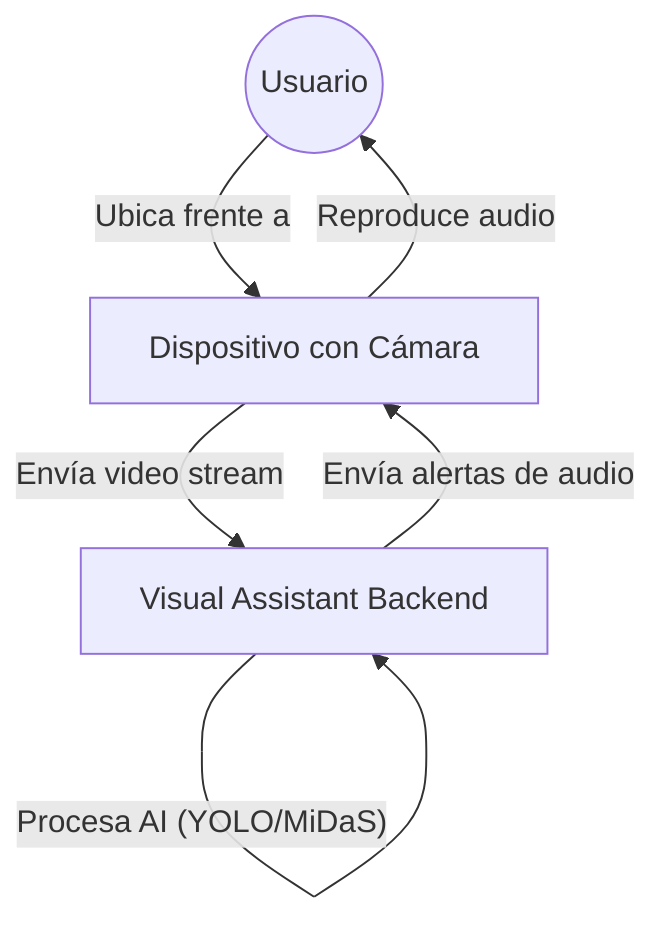
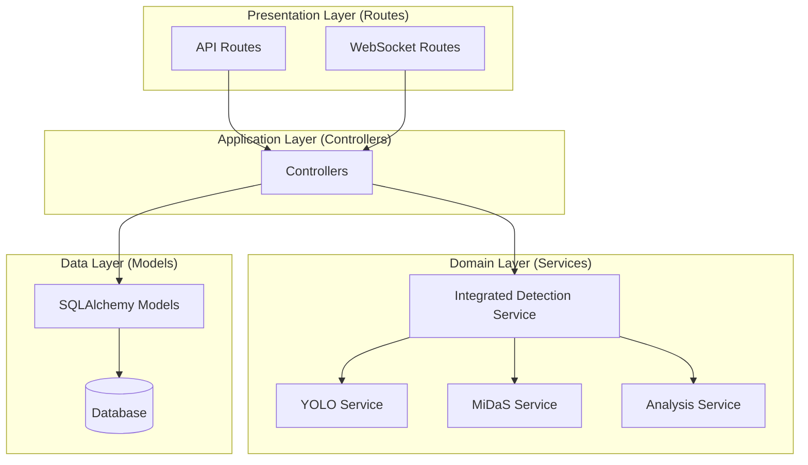
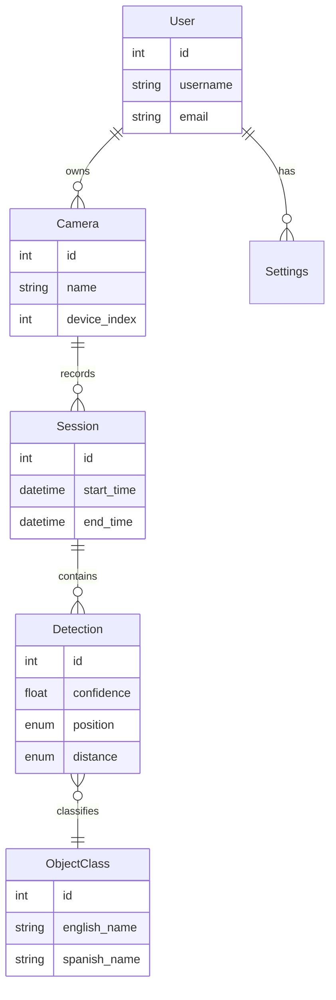
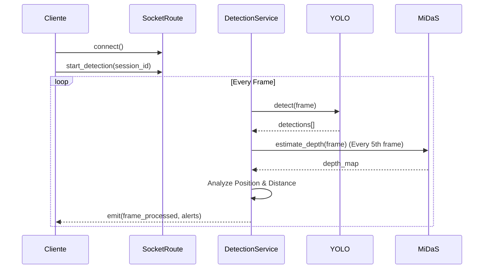

# Documentación de Arquitectura - Visual Assistant

**Versión:** 1.0  
**Fecha:** 24 de Diciembre de 2025  
**Estado:** Borrador Final  

---

## 1. Introducción

### 1.1 Propósito
El propósito de este documento es describir la arquitectura de software del sistema "Visual Assistant". Este sistema tiene como objetivo asistir a personas con discapacidad visual mediante el uso de visión artificial (Computer Vision) para detectar objetos en tiempo real, estimar su distancia y comunicar esta información a través de retroalimentación auditiva.

Este documento sirve como referencia técnica para el desarrollo, mantenimiento y evolución del sistema, y forma parte integral de la tesis de grado asociada.

### 1.2 Alcance
El sistema abarca:
- Una **API REST** para la gestión de usuarios, cámaras y sesiones.
- Un servidor **WebSocket** para el streaming y procesamiento de video en tiempo real.
- Integración de modelos de **Inteligencia Artificial** (YOLOv8, MiDaS).
- Una capa de persistencia de datos relacional.

---

## 2. Visión General del Sistema

El sistema sigue una arquitectura **Cliente-Servidor** donde el cliente (frontend web) captura o envía video, y el servidor (backend) procesa estos datos utilizando modelos de Deep Learning para devolver alertas inteligentes.

### 2.1 Diagrama de Contexto

El usuario interactúa con el sistema a través de un dispositivo (Cámara/Webcam). El sistema procesa la entrada visual y genera salidas de audio.

---

## 3. Stack Tecnológico

La selección tecnológica prioriza el rendimiento en tiempo real y la facilidad de integración de modelos de IA.

| Componente | Tecnología | Descripción |
|------------|------------|-------------|
| **Lenguaje** | Python 3.10+ | Lenguaje principal del backend. |
| **Framework Web** | Flask | Microframework ligero para API REST. |
| **Real-time** | Flask-SocketIO | Comunicación bidireccional (WebSocket). |
| **Servidor WSGI** | Gunicorn / Eventlet | Servidor de producción concurrente. |
| **Base de Datos** | SQLAlchemy (ORM) | Abstracción de base de datos (Soporta SQLite/PostgreSQL). |
| **Visión Artificial** | OpenCV | Procesamiento de imágenes básico. |
| **Detección Objetos** | YOLOv8 (Ultralytics) | SOTA en detección de objetos en tiempo real. |
| **Estimación Profundidad** | MiDaS | Estimación de profundidad monocular. |

---

## 4. Vista Lógica (Arquitectura de Software)

El backend implementa un patrón **MVC (Model-View-Controller)** adaptado para una API, con una capa de Servicios adicional ("Service Layer") para encapsular la lógica de negocio compleja y la IA.

### 4.1 Diagrama de Componentes

### 4.2 Descripción de Módulos

#### 4.2.1 Routes (Vistas)
Puntos de entrada de la aplicación.
- `detection_routes.py`: Endpoints REST para gestión de detecciones.
- `websocket_routes.py`: Manejadores de eventos Socket.IO (`start_detection`, `frame`, `stop_detection`).

#### 4.2.2 Controllers
Orquestan la lógica entre las rutas y los modelos/servicios.
- `DetectionController`: Gestiona la lógica CRUD de detecciones.
- `CameraController`: Gestiona el registro de dispositivos.

#### 4.2.3 Services
Contienen la lógica "dura" del sistema.
- `IntegratedDetectionService`: Facade que coordina todo el proceso de detección. Llama secuencialmente a YOLO y MiDaS.
- `YOLOService`: Wrapper sobre el modelo YOLOv8 para inferencia.
- `MiDaSService`: Wrapper sobre MiDaS para mapas de profundidad.
- `DetectionAnalysisService`: Calcula posición (Izq/Centro/Der) y categoría de distancia (Cerca/Lejos) basándose en los bounding boxes y el mapa de profundidad.

---

## 5. Vista de Datos (Data View)

El sistema utiliza una base de datos relacional para persistir el historial de uso y configuraciones.

### 5.1 Modelo Entidad-Relación (ER)

### 5.2 Diccionario de Datos

- **Detection**: Tabla central (Fact Table). Almacena cada evento de detección.
  - `position`: ENUM ('izquierda', 'centro', 'derecha').
  - `distance_category`: ENUM ('muy_cerca', 'cerca', 'medio', 'lejos').
  - `confidence`: Precisión de la detección (0.0 - 1.0).

---

## 6. Vista de Procesos (Dynamic View)

### 6.1 Flujo de Detección en Tiempo Real

Este es el proceso crítico del sistema. Ocurre dentro de un bucle en el servidor mientras la sesión de WebSocket está activa.

1. **Captura**: El cliente (o servidor) captura un frame de video.
2. **Transmisión**: Si es remoto, se envía por WebSocket.
3. **Inferencia YOLO**: Se detectan objetos y sus Bounding Boxes.
4. **Filtrado**: Se descartan objetos que no están en la lista de interés (ej. solo laptop, celular, llaves).
5. **Inferencia MiDaS** (Opcional/Throttled): Se genera un mapa de profundidad cada N frames para optimizar rendimiento.
6. **Análisis Espacial**:
   - Se determina si el objeto está a la izquierda, centro o derecha.
   - Se calcula la distancia relativa usando el mapa de profundidad dentro del Bounding Box.
7. **Generación de Alerta**:
   - `ShouldAlert?`: Se verifica si ha pasado suficiente tiempo desde la última alerta para este objeto (Anti-spam cooldown).
   - Si sí, se genera el texto: *"Silla a la derecha, muy cerca"*.
8. **Respuesta**: Se envía al cliente el frame procesado (con rectángulos dibujados) y el mensaje de audio/texto.

### 6.2 Flujo de Datos

---

## 7. Despliegue e Infraestructura

### 7.1 Requisitos del Servidor
- **Sistema Operativo**: Linux (Ubuntu 20.04+) o Windows.
- **CPU**: Mínimo 4 núcleos (Recomendado para inferencia neural).
- **RAM**: Mínimo 8GB (Los modelos ocupan memoria considerable).
- **GPU (Opcional)**: NVIDIA con soporte CUDA para acelerar YOLO/MiDaS.

### 7.2 Entorno Python
Se utiliza un entorno virtual (`venv`) con las dependencias listadas en `requirements.txt`.
Principales librerías: `torch`, `opencv-python`, `flask`, `eventlet`.

---
**Visual Assistant Architecture Documentation**
